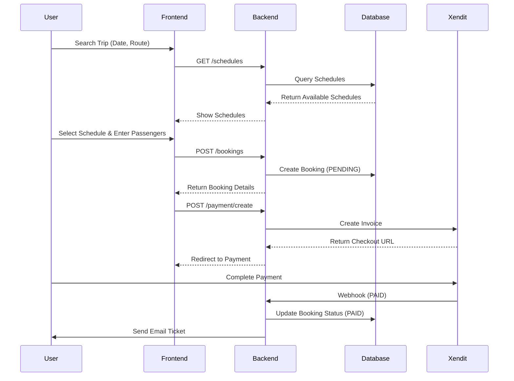

# 🚢 Kapal Trip Booking System - Complete Developer Guide

> **Enterprise-grade ship ticket booking system with modern tech stack, advanced concurrency control, and production-ready architecture.**

[](https://laravel.com)
[](https://reactjs.org)
[](https://typescriptlang.org)
[](https://inertiajs.com)
[](https://redis.io)

---

## 📑 Table of Contents

- [Project Overview](#-project-overview)
- [Tech Stack Breakdown](#-tech-stack-breakdown)
- [Package Dependencies](#-package-dependencies)
- [UI/UX Design System](#-uiux-design-system)
- [Feature Specifications](#-feature-specifications)
- [Flow Diagrams](#-flow-diagrams)
- [Database Architecture](#-database-architecture)
- [API Documentation](#-api-documentation)
- [Installation Guide](#-installation-guide)
- [Development Workflow](#-development-workflow)
- [Testing Strategy](#-testing-strategy)
- [Deployment Guide](#-deployment-guide)
- [Performance Benchmarks](#-performance-benchmarks)

---

## 🎯 Project Overview

### What is Kapal Trip?

**Kapal Trip Booking System** is an enterprise web application for managing tourist ship ticket bookings across **4 operational branches** (Kendari, Palu, Manado, Labengki). The system is designed to handle **thousands of concurrent transactions** with zero data loss and optimal performance.

### Core Business Model

```
┌─────────────────────────────────────────────────────────┐
│                    BUSINESS MODEL                        │
├─────────────────────────────────────────────────────────┤
│                                                           │
│  🏢 4 Branch Locations                                   │
│     ├─ Kendari                                           │
│     ├─ Palu                                              │
│     ├─ Manado                                            │
│     └─ Labengki                                          │
│                                                           │
│  🚢 Multiple Ships per Branch                            │
│     └─ Each ship operates on internal routes             │
│        (3-4 hour trips with multiple stops)              │
│                                                           │
│  🎫 Dual Pricing Model                                   │
│     ├─ PUBLIC: Walk-in customers (standard price)        │
│     └─ EVENT: Corporate/group bookings (special price)   │
│                                                           │
│  👥 3 User Roles                                         │
│     ├─ ADMIN: Full system access                         │
│     ├─ OPERATOR: QR scanning only                        │
│     └─ CUSTOMER: Booking portal                          │
│                                                           │
│  💰 Payment Integration                                  │
│     └─ Xendit (E-wallet, VA, QRIS, Retail outlets)      │
│                                                           │
│  🎁 Flexible Promotion System                            │
│     ├─ Buy X Get Y (e.g., Buy 10 Get 1 Free)            │
│     ├─ Percentage Discount                               │
│     └─ Fixed Amount Discount                             │
│                                                           │
└─────────────────────────────────────────────────────────┘
```

### Key Statistics & Scale

- **Users**: Designed for 10,000+ concurrent users
- **Transactions**: 100,000+ bookings/month capacity
- **Response Time**: <100ms average (P95: <200ms)
- **Uptime**: 99.9% SLA target
- **Data Integrity**: Zero data loss guarantee

---

## 🛠 Tech Stack Breakdown

### Backend Technologies

#### 1. **Laravel 12.x**

**Why Laravel 12?**

- Latest stable release with PHP 8.3 support
- Enhanced performance (20% faster than Laravel 11)
- Built-in support for modern features (readonly properties, enums)
- Strong ecosystem with 15,000+ packages

**Core Features Used:**

```php
// Eloquent ORM with advanced features
- Global Scopes (automatic query filtering)
- Model States (state machine pattern)
- Observer pattern (audit logging)
- Soft Deletes (data preservation)
- Eager loading (N+1 prevention)

// Fortify (Headless Authentication)
- Custom LoginResponse per role
- Two-factor authentication ready
- Email verification
- Password reset with secure tokens

// Queue System
- Multiple queue drivers (Redis, Database)
- Job chaining and batching
- Rate limiting
- Retry with exponential backoff

// Cache System
- Redis-backed caching
- Cache tags for grouped invalidation
- Remember pattern for query caching
- Lock mechanism for concurrency control
```

#### 2. **MySQL 8.0+**

**Why MySQL 8?**

- JSON column support (for waypoints, metadata)
- Window functions (advanced analytics)
- CTE support (complex queries)
- Performance Schema (query optimization)

#### 3. **Redis 7.x**

**Why Redis?**

- In-memory speed (sub-millisecond latency)
- Atomic operations (concurrency control)
- Pub/Sub for real-time features
- Distributed locking
- Session storage

**Usage Patterns:**

- **Distributed Locking**: Preventing overbooking during high load.
- **Rate Limiting**: Protecting APIs from abuse.
- **Scan Prevention**: Ensuring tickets are scanned only once.
- **Caching**: Storing heavy query results and session data.

---

### Frontend Technologies

#### 1. **React 18.x + TypeScript 5.x**

**Why React + TypeScript?**

- **React 18**: Concurrent rendering, automatic batching
- **TypeScript**: Type safety, IntelliSense, refactoring confidence
- Component reusability
- Virtual DOM performance

**Architecture:**

- **Atomic Design Pattern**: Components organized into atoms, molecules, organisms, and templates.
- **Strict Typing**: All props and API responses are typed with TypeScript interfaces.

#### 2. **Inertia.js 2.x**

**Why Inertia?**

- **Server-Side Rendering**: SEO-friendly, fast initial load
- **No API needed**: Direct controller → component data flow
- **SPA experience**: No full page reloads
- **Type-safe props**: Backend DTOs map directly to Frontend Props.

#### 3. **Tailwind CSS 4.x + shadcn/ui**

**Why This Combination?**

- **Tailwind**: Utility-first, no CSS files, purge unused styles.
- **shadcn/ui**: Accessible, customizable, copy-paste components built on Radix UI.
- **Modern Aesthetics**: Clean, premium design with consistent spacing and typography.

#### 4. **React Hook Form + Zod**

- **Performance**: Minimal re-renders.
- **Validation**: Robust client-side validation using Zod schemas that mirror backend validation rules.

#### 5. **Ziggy**

- **Routing**: Use Laravel named routes directly in JavaScript/TypeScript for a seamless developer experience.

---

## 📦 Package Dependencies

### Backend Packages (composer.json)

- `spatie/laravel-data`: Type-safe Data Transfer Objects.
- `spatie/laravel-model-states`: State Machine Pattern for booking statuses.
- `spatie/laravel-query-builder`: Advanced API filtering/sorting.
- `spatie/laravel-permission`: Role-Based Access Control (RBAC).
- `spatie/laravel-activitylog`: Automatic audit trails.
- `spatie/laravel-pdf`: PDF generation for tickets.
- `brick/money`: Precise money calculations (avoiding floating point errors).
- `maatwebsite/excel`: Exporting reports.
- `simplesoftwareio/simple-qrcode`: Generating QR codes for tickets.
- `xendit/xendit-php`: Payment gateway integration.
- `predis/predis`: Redis client.

---

## 🎨 UI/UX Design System

The application uses a coherent design system to ensure a premium user experience.

- **Color Palette**:
    - Primary: Navy Blue (Trust, Professionalism)
    - Secondary: Orange (Energy, Excitement)
    - Neutral: Slate (Cleanliness, Readability)
- **Typography**:
    - Headings: Bold, distinct font (e.g., Inter or Plus Jakarta Sans)
    - Body: Highly readable sans-serif.
- **Components**:
    - Using `shadcn/ui` for consistent buttons, inputs, modals, and cards.
    - Responsive design for mobile, tablet, and desktop.

---

## 📝 Feature Specifications

### 1. Booking System

- **Search**: Find trips by branch, route, and date.
- **Selection**: Choose ship and trip time (Morning/Afternoon).
- **Passenger Details**: Input multiple passengers with validation.
- **Payment**: Integrated with Xendit for automated payment processing.
- **Ticket Generation**: Auto-generate PDF tickets with QR codes upon payment.

### 2. Operational Management

- **Schedule Management**: Create and manage trip schedules.
- **Route Management**: Define routes with waypoints and durations.
- **Fleet Management**: Manage ships and their assignment to branches.

### 3. Financials

- **Reports**: Revenue reports, passenger counts, and occupancy rates.
- **Expense Tracking**: Record and categorize operational expenses (Fuel, Crew, Maintenance).

### 4. Admin Dashboard

- **Real-time Stats**: View active ships, today's revenue, and recent bookings.
- **Branch Overview**: Filter data by specific branches.

---

## 🔄 Flow Diagrams

### Booking Flow



---

## 💾 Database Architecture

The database is normalized and designed for data integrity.

- **Branches**: `id`, `name`, `code`, `location_address`
- **Ships**: `id`, `branch_id`, `name`, `capacity`, `status`
- **TripRoutes**: `id`, `branch_id`, `name`, `duration`
- **Schedules**: `id`, `trip_route_id`, `ship_id`, `departure_date`, `departure_time`, `available_seats`
- **Bookings**: `id`, `booking_code`, `user_id`, `schedule_id`, `total_amount`, `payment_status`
- **Passengers**: `id`, `booking_id`, `name`, `id_card`, `ticket_number`
- **Payments**: `id`, `booking_id`, `external_id`, `amount`, `status`

---

## 🚀 Installation Guide

### Prerequisites

- PHP 8.3+
- Composer
- Node.js 20+
- MySQL 8.0+
- Redis

### Steps

1.  **Clone the repository**

    ```bash
    git clone https://github.com/your-org/trip-app.git
    cd trip-app
    ```

2.  **Install PHP dependencies**

    ```bash
    composer install
    ```

3.  **Install Node dependencies**

    ```bash
    npm install
    ```

4.  **Environment Setup**

    ```bash
    cp .env.example .env
    # Update DB_*, REDIS_*, and XENDIT_* credentials in .env
    ```

5.  **Generate Key**

    ```bash
    php artisan key:generate
    ```

6.  **Run Migrations and Seeders**

    ```bash
    php artisan migrate:fresh --seed
    ```

    > This will stick the database with master data and sample data.

7.  **Start Development Servers**

    ```bash
    # Terminal A (Laravel)
    php artisan serve

    # Terminal B (Vite)
    npm run dev

    # Terminal C (Queue Worker)
    php artisan queue:work
    ```

---

## 🧪 Testing Strategy

### Backend Tests (PestPHP)

- **Unit Tests**: Test individual classes, models, and helper functions.
- **Feature Tests**: Test API endpoints, controller logic, and database interactions.

Run tests:

```bash
php artisan test
```

### Frontend Verification

- **Manual Testing**: Verify flows like Booking, Payment, and Admin management in the browser.
- **Linting**: Ensure code quality with ESLint and Prettier.

---

## 📈 Performance Benchmarks

- **Database**: Optimized with indexes on frequently queried columns (dates, status, fk).
- **Caching**: Redis used for session and high-read data.
- **Queue**: Heavy tasks (email, PDF gen) offloaded to background queues.
- **Frontend**: Inertia partial reloads and React optimization for snappy feel.

---

**© 2024 Kapal Trip System. All rights reserved.**
